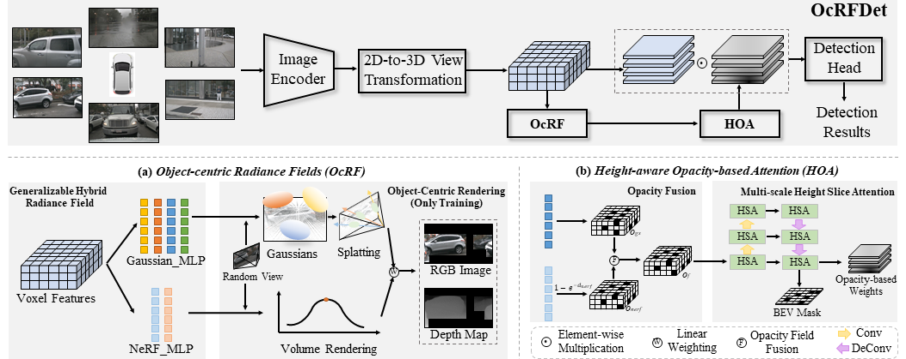

# OcRFDet: Object-Centric Radiance Fields for Multi-View 3D Object Detection in Autonomous Driving

<div align="center">

[Mingqian Ji](https://github.com/Mingqj) </sup>,
[Shanshan Zhang](https://shanshanzhang.github.io/) ✉</sup>,
[Jian Yang](https://scholar.google.com/citations?user=6CIDtZQAAAAJ&hl=zh-CN) </sup>

Nanjing University of Science and Technology

✉ Corresponding author

[](https://arxiv.org/abs/2506.23565)
[](https://www.apache.org/licenses/LICENSE-2.0)

</div>

## 📖 About

This repository represents the official implementation of the paper titled "OcRFDet: Object-Centric Radiance Fields for Multi-View 3D Object Detection in Autonomous Driving".

We propose Object-Centric Radiance Fields (OcRF) to enhance multi-view 3D object detection by focusing rendering on foreground objects and filtering out background noise. An auxiliary rendering task improves 3D voxel features, while the generated opacity maps are used to refine BEV features through Height-aware Opacity-based Attention (HOA). This explicit geometry-aware design significantly boosts the detector’s ability to understand 3D structure from multi-view RGB images.




## 💾 Main Results

**nuScenes val set**
| Config                                    | mAP  | NDS |                                                Model                                                |
|:-----------------------------------------:|:----:|:----:|:--------------------------------------------------------------------------------------------------:|
| [**OcRFDet**](configs/ocrfdet/ocrfdet.py) | 40.0 | 50.9 |[GoogleDrive](https://drive.google.com/file/d/1xvFha8d3OucWoxgL3w3Z1MNmh_HhiyWs/view?usp=drive_link)|

**nuScenes test set**
| Config    | mAP  |  NDS |                                             Model                                                  |
|:---------:|:----:|:----:|:--------------------------------------------------------------------------------------------------:|
|**OcRFDet**| 57.2 | 64.8 |[GoogleDrive](https://drive.google.com/file/d/1iJWmquYLXv5mRAaWbP6ThBgjrPVvzv5Q/view?usp=drive_link)|

## Get Started

#### 🛠️ Installation and Data Preparation

1. Please refer to [getting_started.md](docs/en/getting_started.md) for installing OcRFDet as mmdetection3d. [Docker](docker/Dockerfile) is recommended for environment preparation.
2. Prepare nuScenes dataset as introduced in [nuscenes_det.md](docs/en/datasets/nuscenes_det.md) and create the pkl for OcRFDet by running:

```shell
python tools/create_data_bevdet.py
```
3. Please follow the baseline (DualBEV) to download nuScenes-lidarseg from nuScenes official site and put it under data/nuscenes/. Create depth and semantic labels from point cloud by running:

```shell
python tools/generate_point_label.py
```

4. Please follow the MVSGaussian to install the Gaussian Splatting renderer by running:

```shell
cd mmdet3d/models/necks/MVSGaussian
pip install lib/submodules/diff-gaussian-rasterization
pip install lib/submodules/simple-knn
```

#### 🏋️ Train OcRFDet model
```shell
bash tools/dist_train.sh configs/ocrfdet/ocrfdet.py 8
```

#### 📋 Test OcRFDet model
```shell
bash tools/dist_test.sh configs/ocrfdet/ocrfdet.py  work_dirs/ocrfdet/epoch_20_ema.pth 8 --no-aavt --eval mAP
```

#### 👀 Visualize the predicted result.
```shell
python tools/test.py ./configs/ocrfdet/ocrfdet.py work_dirs/ocrfdet/epoch_20_ema.pth --format-only --eval-options jsonfile_prefix='./work_dirs/visual/'
```

## ❛❛❞ Citation
```bibtex
@article{ji2025ocrfdet,
  title={OcRFDet: Object-Centric Radiance Fields for Multi-View 3D Object Detection in Autonomous Driving},
  author={Ji, Mingqian and Yang, Jian and Zhang, Shanshan},
  journal={arXiv preprint arXiv:2506.23565},
  year={2025}
}
```

## ❤️ Acknowledgement

We thank these great works and open-source codebases: [MMDetection3D](https://github.com/open-mmlab/mmdetection3d), [BEVDet](https://github.com/HuangJunJie2017/BEVDet), [DualBEV](https://github.com/PeidongLi/DualBEV), [MVSGaussian](https://github.com/TQTQliu/MVSGaussian).
